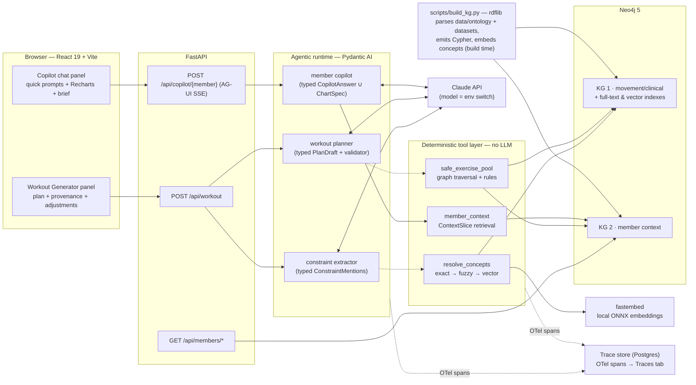

# Knowledge-Graph Coach Dashboard

A coach-facing dashboard that **generates safe, personalized workouts** and answers
member-context questions through an **AI copilot** — with every recommendation driven by a
knowledge graph, not by the language model alone. The LLM composes; the graph decides.
(The original assessment brief lives in [ASSESSMENT.md](ASSESSMENT.md).)

Two graphs power two surfaces:

- **KG 1 (movement/clinical)** — 50 catalog exercises joined to a curated ontology subset
  (SNOMED CT anatomy, OPE/COPPER alignments, SKOS mappings, PROV-O provenance) with 22
  mechanics-based contraindication rules. ([Abbreviations](#abbreviations) if any of that
  is unfamiliar.)
- **KG 2 (member context)** — one member's profile, goals, injuries, equipment, workout
  history, adherence, biomarkers, labs, chat, and coach brief, cross-linked into KG 1.

## Run it

```bash
cp .env.example .env   # add ANTHROPIC_API_KEY for the AI features
make up                # build, start Neo4j + graph build + API + web, print the URLs
```

`make up` waits until every service actually serves, then prints where to go:

```
   Web app        http://localhost:5173   <- open this
   API docs       http://localhost:8000/docs
   Neo4j Browser  http://localhost:7474   (neo4j / password)

   Graph          50 exercises, 1 member(s) loaded
   AI features    enabled (claude-haiku-4-5)
```

Open the web app and sign in with any name — auth is mocked. The one-shot `kg-build`
service constructs both graphs before the API starts and is idempotent, so it is safe to
re-run on every `up`. Without an `ANTHROPIC_API_KEY` everything except the two AI features
works (those endpoints return a clear 503); add the key and run `make restart`.

`make` wraps `docker compose`, which still works directly if you prefer it:

| Target | What |
| --- | --- |
| `make up` | build + start everything, then print the banner |
| `make down` | stop the stack (the graph survives in the `neo4j-data` volume) |
| `make logs` | follow logs for all services |
| `make restart` | recreate api + web to pick up `.env` changes |
| `make rebuild` | re-run the knowledge-graph build against the running Neo4j |
| `make test` | backend pytest + frontend type-check and lint |

## Architecture



The load-bearing decision is the boundary between the agents and the tool layer: the
resolver, safety traversal, and context retrieval are **plain Python + Cypher**. The
workout generator is a *shallow deterministic loop* — extract constraints (LLM), resolve
them onto graph concepts (no LLM), traverse the graph for the safe pool (no LLM), compose
a plan from that pool (LLM). An output validator rejects any plan referencing an exercise
outside the pool, so the model **cannot re-introduce a filtered exercise** even if it
tries. Safety is a graph property, not a prompt instruction.

## The graphs, briefly

Full schema and the left-out analysis: **[docs/kg1-schema.md](docs/kg1-schema.md)** ·
dataset field guide: **[docs/data-overview.md](docs/data-overview.md)** ·
churn scoring method: **[docs/churn-risk-classification.md](docs/churn-risk-classification.md)**.

**KG 1** — 9 node types: `Exercise` (50), the four catalog vocabularies
(`MuscleGroup` 19, `Joint` 9, `MovementPattern` 36, `Equipment` 32, all carrying a
`Concept` label with labels/synonyms/embeddings so the resolver queries one index),
`AnatomicalStructure` (173 SNOMED structures with 130 `PART_OF` + 28 `IS_A`
hand-classified edges), `Condition` (16, `ANCHORED_AT` their anatomy), and `SafetyRule`
(22, `CONTRAINDICATED_FOR` their condition). The 9 catalog joints **are** their SNOMED
exact-match structures (one node, two labels) — that identity is what lets the anatomy
closure (`PART_OF|IS_A*0..5` plus one bounded step back down) terminate on a node that
exercises `STRESSES` directly.

The honest headline from curation: only **44 of 112** catalog concepts reach a
`skos:exactMatch` in any published ontology. Anatomy is superbly covered by SNOMED;
movement and equipment are barely covered by anything — no published ontology in scope
even has a concept for *plyometric/impact loading*, the single most load-bearing safety
concept in the dataset, so it is minted locally with a documented `declined` analysis.

**KG 2** — `Member` plus goals, injuries, workout sessions, adherence weeks, biomarkers,
weight samples, lab panels/results, chat messages, the coach brief (morning tasks), and a
computed `ChurnAssessment` — a point-scored level whose reasons each cite a real field,
replacing the dataset's hand-written churn block. Cross-links into KG 1: `HAS_EQUIPMENT → Equipment` and `inj_knee_left —AFFECTS→ jt_knee`
(which carries its SNOMED mapping). "Now" is anchored to the brief's date (2026-06-04)
on the member node — trend math never touches the wall clock.

### Why the graph earns its keep

Filtering on `joints_loaded ∋ knee` fails in *both directions* for the sample member
(recovering patellofemoral pain): it bans Cow Pose and World's Greatest Stretch — both
explicitly appropriate — and lets **Jumping Jack** through, because its catalog row omits
the knee. The rule layer matches on *movement mechanics* gated by the *anatomy closure*:
the impact rule deliberately waives its anatomy gate (landing forces travel the whole
kinetic chain, and the tagging is demonstrably incomplete), which is exactly what catches
Jumping Jack; the allow rule rescues unloaded therapeutic work over the irritable joint.
Result for the member's 21 equipment-feasible exercises: 6 excluded with graph-path
provenance, mobility work kept, and one exercise down-ranked instead of banned because
her own most recent chat reports pain-free box squats. No anatomy-only filter can
reproduce this.

## The resolver and the safety traversal

**`resolve_concepts`** (LLM-free) — three passes with explicit thresholds: case-insensitive
exact match on labels/synonyms (score 1.0), Lucene full-text with per-token fuzz
(accept ≥ 1.5), fastembed vector fallback against the concept index (accept ≥ 0.78
cosine-index score). A curated ambiguity policy runs first: "lower back" resolves to the
lumbar spine in injury context, the muscle group in targeting context, and to *both,
flagged* when the context is unknown. Unresolvable terms return `resolved=False` with a
reason — never dropped, never force-matched. The messy documented cases all pass:
`"knee"→jt_knee`, `"kettlebell"→eq_kettlebell` (and the typo `"ketlebell"` via fuzz),
`"bad lower back"→jt_lumbar_spine`, and the zero-literal-match dislikes
`"Deadlift"/"Burpees"` onto their curated movement patterns.

**`safe_exercise_pool`** (LLM-free) — recorded filter stages: explicit exclusions →
equipment `REQUIRES ⊆ available` subset test → all 22 rules evaluated per candidate
(no short-circuit; the full fired set is kept for provenance) → preference down-ranking
(dislikes are preferences, never safety — conflating them would corrupt the audit trail).
Rule semantics worth naming: `mechanics_all_of` must hold on a *single* pattern (the
conjunction describes one mechanism), `mechanics_none_of` vetoes at exercise level (the
guard that stops an allow rule rescuing something high-impact), pattern-level load is
narrowed by the exercise's `supports_weight` flag, anatomy-gated rules can never vouch
for rows whose `joints_loaded` was empty (missing means *unknown*, not safe), and acute
injuries escalate down-ranks to exclusions. Every inclusion and safety exclusion carries
a `GraphPath` — walked nodes plus re-runnable Cypher — which is what makes "the graph
decided" checkable rather than asserted.

## Example runs

Full traces (real output from the live graph, regenerable via
`scripts/example_runs.py`): **[docs/example-runs.md](docs/example-runs.md)**.

**1 · Injury case** — "Lower-body strength session, 50 minutes." Member defaults
auto-load from KG 2; the injury's free-text note resolves to `cond_pfps` (full-text,
score 8.4). Six exercises are excluded with provenance — three plyometric by the
anatomy-waived impact rule (including Jumping Jack), three loaded deep-knee-flexion by
the anatomy-gated rule, each carrying the path
*patellofemoral joint → component of knee joint → knee joint [catalog]* — leaving a
15-exercise safe pool with Cow Pose and World's Greatest Stretch explicitly rescued.

**2 · Limited-equipment case** — adjustment *"no barbell, only dumbbells and a
kettlebell"*. The restriction resolves through the resolver, replaces the availability
list, and the pool collapses to the exercises requiring ⊆ {Dumbbell, Kettlebell}
(bodyweight always qualifies); every equipment exclusion carries substitution
suggestions drawn from the surviving safe pool (e.g. Barbell Decline Bench Press →
Dumbbell Neutral-Grip Bench Press, sharing the horizontal-push pattern).

**3 · Explicit exclusion** — adjustment *"exclude deadlifts"*. No catalog exercise is
named "deadlift" (quirk 9); the resolver lands the word on the hip-hinge pattern via
curated synonyms and both hamstring-walkout hinges leave the pool as explicit
exclusions.

Adjustments work by sending the previous response's `constraints_used` back with the
follow-up message; the constraint set merges and resolution + traversal re-run.

## Tech choices

The full decision docs: **[docs/tech-stack.md](docs/tech-stack.md)**,
**[docs/knowledge-graph-options.md](docs/knowledge-graph-options.md)**,
**[docs/agent-framework-options.md](docs/agent-framework-options.md)**.

| Choice | Why (and the trade-off taken) |
|---|---|
| Neo4j Community | One store covers all three resolver passes (full-text + vector indexes) and Cypher paths serialize straight into the PROV trace. Trade-off: a second container vs. rdflib-in-process — accepted for the Browser demo and the indexes. |
| rdflib at build time only | Curated JSON → SKOS/PROV triples → Cypher. No reasoner in the request path; RDF is derived, never hand-maintained. |
| fastembed (local ONNX) | $0, deterministic, no API key for ~200 short strings; one pinned model shared by build time and query time so cosine scores stay meaningful. |
| Pydantic AI | Typed agent outputs (`WorkoutPlan`, `CopilotAnswer`) double as the FastAPI response schemas — one contract from model to browser; DI injects the Neo4j driver into the tool layer; the AG-UI adapter gives copilot streaming nearly free. |
| Claude via one env switch | `ANTHROPIC_MODEL` in `.env` (`claude-haiku-4-5` to validate cheaply, `claude-opus-5` for demo runs). Effort settings are applied only on models that support them — the single place that branches on model. |
| FastAPI + uv · React 19 + Vite + Tailwind + shadcn | Boring, fast, typed. Frontend API types are *generated* from the Pydantic schemas (`npm run gen:api`). |
| Recharts | The copilot emits declarative JSON chart specs; Recharts' props match that shape 1:1. |
| Self-hosted trace store (Postgres) via OTel | Pydantic AI emits OTel natively, so the sink is swappable; writing to one local Postgres (~256 MB) means tracing works with no account and no keys, where a cloud tier left reviewers with no observability at all. OTel is the seam: swapping agent frameworks touches one module. |

One deviation from plan, stated honestly: the tech-stack doc named Vercel AI Elements for
the chat panel; its component registry was unreachable from the build environment, so the
chat components are hand-built in the same style directly over `@ag-ui/client`.

## Data quirks handled

The dataset is deliberately messy; [docs/data-overview.md §4](docs/data-overview.md)
catalogs 14 quirks. Where each one is handled:

| Quirk | Handling |
|---|---|
| `is_bilateral` semantics inverted (q1) | Stored as `has_bilateral_pair`; unilaterality comes from `side` |
| All `bilateral_pair_id` values dangling (q2) | Dropped at ingest, documented |
| Zero-entropy fields (q3) | Dropped at ingest |
| Empty `joints_loaded` (q4) | `stresses_recorded=false` — *unknown, not safe*; anatomy-gated rules can't vouch for these rows, mechanics-only rules still fire (this is what catches Jumping Jack) |
| Truncated `"car"` pattern (q5) | Curated as `mp_car` (controlled articular rotation) keyed by the catalog term |
| Duplicate joint entry (q6) | Deduped at ingest |
| Lopsided pattern taxonomy (q7) | Faceted curation instead of splitting on `" - "` |
| Dislikes match nothing literally (q9) | Resolver lands them on curated pattern synonyms; **down-ranked, never safety-excluded** |
| History names join nothing (q10) | Stored as free text on session nodes; never joined |
| Unbacked "login frequency" churn reason (q11) | The file's churn block is **not ingested**; churn risk is computed from adherence and workout history instead, so every reason names a real field ([docs](docs/churn-risk-classification.md)) |
| Labs without reference ranges (q12) | The copilot must hedge or cite an explicitly-external range |
| Dates run to mid-2026 (q13) | `now_anchor=2026-06-04` on the member node; all trend math uses it |
| `attachments` absent-not-null (q14) | `.get()` semantics at ingest |

## Tests

`backend/tests/` holds the two required suites (resolver, safety filter), both LLM-free,
in two layers: unit tests of the decision logic run offline against fakes (pass
thresholds at their exact boundaries, rule-evaluation semantics, graceful degradation),
and integration tests replay the documented reference scenarios against the real built
graph (the 21-exercise pool, the 6-exclusion knee case *in both failure directions*,
explicit exclusions, alternatives, preference down-ranks), skipping cleanly when Neo4j
is down. Every non-trivial test carries a comment naming the user-facing failure it
guards; each module documents why its paths are the critical ones.

## Observability

Nothing to configure: generate one workout and ask the copilot one question, then open the
**Traces** tab. Full details in **[docs/observability.md](docs/observability.md)**.

Every LLM call, tool call, and Neo4j query is recorded as an OpenTelemetry span in a local
Postgres. One API request is one trace, so a single `POST /api/workout` reads end to end —
member defaults, the `constraint-extractor` and `workout-planner` agent runs with their
model requests, the resolver and safety `neo4j.query` traversals — with per-span timings,
token counts, cost, and truncated prompts and completions. Traces are named by what ran
(`constraint-extractor → workout-planner`), and the list defaults to AI runs with All
requests and Errors alongside. `/api/health` and the trace API itself are excluded: the
healthcheck polls every five seconds, and tracing the Traces page would be a feedback loop.

The design point is that **OpenTelemetry is the seam, not the vendor**. Pydantic AI emits
OTel spans natively, so the store, read API, and UI never learn what framework produced
them: one module (`app/observability/ingest.py`) maps raw spans onto the app's own shape,
and a test asserts no `gen_ai.*` key appears anywhere else. Swapping Pydantic AI for
LangGraph or the raw Anthropic SDK is a one-file edit. That also means the sink is
swappable — `OBS_DATABASE_URL` alone switches the Postgres service for a SQLite file, which
is the default when running outside Docker.

## Evaluating this in production

**Metrics.** Resolver: precision/recall against a labeled set of coach surface forms,
plus the unresolved rate — a rising unresolved rate is a vocabulary gap while rising
force-matches are a threshold bug, so they must be tracked separately. Generator:
pool-correctness golden tests on every curated-rule change (the 21/6/15 reference
numbers live in CI today), plan validity rate (validator retries per request), time-fit
error, p95 latency against the ~5 s target, and token cost per plan. Copilot: citation
coverage — the share of numeric claims traceable to a fetched context slice, checkable
mechanically because answers are typed and citations are a required field — plus a
hallucinated-number spot-check eval and chart-spec validity.

**Failure modes to expect.** Silent resolver drift after re-embedding or an embedding
model swap (the model is pinned; re-run the boundary tests on any change). Rule gaps —
hip and thoracic spine have *no* conditions anchored to them today, so complaints there
degrade to the blunt joint-level filter (documented in the schema doc §9). Stale graph
after catalog edits (the build script's integrity checks fail loudly rather than load
partially). Empty pools under tight constraints (surfaced as a 422 with the reason,
never a silently degraded plan). LLM schema misses (bounded retries; the pool-membership
invariant cannot be bypassed).

**Safety monitoring.** The PROV model is the monitoring hook: every exclusion is
attributed to the rule engine, never the language model — a trace showing a safety
decision associated with the LLM *is a bug visible in the data*. Alert on: any plan
exercise not in its pool (invariant breach — should be impossible), unresolved injury
constraints (the pool result carries an explicit "cannot filter — surface to the coach"
note), and coach overrides of safety exclusions (recorded, attributed to the coach, and
reviewed as a queue). Model or prompt changes go through the golden-scenario evals
before rollout.

## Seeing the graph

In the app, the **Knowledge graph** tab (top nav, next to Coaching tools) renders the
member-centric subgraph behind every safety decision: Jordan → her left-knee injury →
the knee joint → the exercises that load it, with the exercises a safety rule
contraindicates marked in red. Hovering a node isolates its neighbourhood; clicking one
opens an inspector showing exactly what the graph stores about it.

Two kinds of edge are drawn, and the difference is the point:

- **Solid** edges are stored in Neo4j (`HAS_INJURY`, `AFFECTS`, `STRESSES`, `TARGETS`, …).
- **Dashed** edges are *derived at request time* and exist in no database. `RESOLVES_TO`
  is the resolver mapping the injury's free-text note ("Patellofemoral pain after a
  hiking trip…") onto the `cond_pfps` concept; `BLOCKS` is a safety rule firing against
  an exercise. The panel underneath lists the resolution steps that produced them.

The view is served by `GET /api/graph/member/{member_id}` (`backend/app/graph.py`), which
runs the same `resolve_concepts` → `safe_exercise_pool` path the workout generator uses,
so the two can never disagree about what is unsafe. It deliberately evaluates safety over
the whole catalog rather than only the member's available equipment — otherwise a
contraindicated exercise they happen to lack kit for would render as unblocked.

For ad-hoc queries, open Neo4j Browser at http://localhost:7474 and run:

```cypher
// The knee neighbourhood: condition → anatomy closure → joint ← exercises
MATCH p = (c:Condition {id:'cond_pfps'})-[:ANCHORED_AT]->()-[:PART_OF*0..3]->(j:Joint {id:'jt_knee'})
RETURN p
UNION
MATCH p = (j:Joint {id:'jt_knee'})<-[:STRESSES]-(e:Exercise)
RETURN p
```

```cypher
// The member and everything she links to, including the KG 1 cross-links
MATCH p = (m:Member)-[r]->(n) RETURN p LIMIT 100
```

(No screenshot is committed — the Knowledge graph tab renders the same view live, and the
queries above reproduce it in Neo4j Browser.)

## How AI was used to build this

The project was built with Claude (Claude Code) working from the issue backlog (#1–#14),
one issue per commit. The workflow that mattered: every ingest and tool change was
verified against a **live Neo4j** (an in-process test harness) rather than assumed — the
reference numbers (21-exercise pool, 6 exclusions, 16/16 condition reachability) were
checked on the real graph before each commit, and two real bugs were caught that way (a
SKOS `narrower` mapping making a promote rule over-fire, and a dropped rule-escalation
flag). LLM-dependent paths were validated with deterministic stand-in models so the
pipeline, validators, and streaming protocol are exercised end-to-end without an API
key. The curated ontology mappings in `data/ontology/` were verified against the live
NCI EVS / BioPortal APIs at curation time rather than recalled. All AI-written code went
through the same checks as any code: `pytest`, `tsc`, lint, and the golden scenarios.

## Abbreviations

| Term | Meaning |
|---|---|
| AG-UI | Agent–User Interaction protocol — Pydantic AI's streaming transport to the browser (over SSE) |
| COPPER | BioPortal ontology of physical-activity and behaviour-change concepts; a narrow slice (activity types, pain barriers) is aligned here |
| KG | Knowledge graph — KG 1 is movement/clinical, KG 2 is member context |
| NCI EVS | National Cancer Institute Enterprise Vocabulary Services — the API the SNOMED CT codes were verified against |
| NCIT | NCI Thesaurus — the anatomy/injury vocabulary OPE imports (614 classes) |
| ONNX | Open Neural Network Exchange — the model format fastembed runs locally |
| OPE | Ontology of Physical Exercises (BioPortal, 2013) — supplies exercise property vocabulary; only 19 native classes |
| PFPS | Patellofemoral pain syndrome — the sample member's knee condition (`cond_pfps`) |
| PROV-O | W3C Provenance Ontology — models who or what asserted each decision (rule engine vs. LLM vs. coach) |
| RDF / Turtle | Resource Description Framework and its text serialization (`.ttl`) — the triples rdflib emits at build time |
| SKOS | Simple Knowledge Organization System — the mapping vocabulary (`exactMatch`, `closeMatch`, `broader`, `related`) linking catalog terms to ontology concepts |
| SNOMED CT | Systematized Nomenclature of Medicine – Clinical Terms — the clinical terminology supplying anatomy and conditions |

Prefixes and full IRIs for every vocabulary above live in
[`data/ontology/namespaces.json`](data/ontology/namespaces.json).

## Layout

| Path | What |
|---|---|
| `scripts/build_kg.py` | Builds both graphs (rdflib → Cypher, embeddings, integrity checks, post-load verification) |
| `backend/app/kg/` | The deterministic tool layer: resolver, safety traversal, embeddings |
| `backend/app/agents/` | Pydantic AI agents: extractor, planner, copilot + the model switch |
| `backend/app/` | FastAPI routers: members, workout, copilot (AG-UI) |
| `backend/app/observability/` | Trace store: span ingest (the framework seam), SQL store, exporter, `/api/traces` |
| `backend/tests/` | Resolver + safety + tracing suites (unit offline, integration on the live graph) |
| `frontend/src/` | Dashboard shell, generator panel, copilot panel, traces view, generated API types |
| `data/ontology/` | The curated ontology subset (see its README) |
| `docs/` | Schema, dataset guide, decision docs, example runs |
