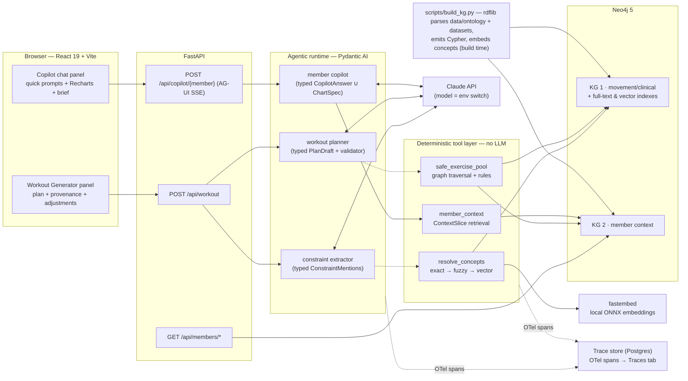

# Knowledge-Graph Coach Dashboard

A coach-facing dashboard that **generates safe, personalized workouts** and answers
member-context questions through an **AI copilot** — with every recommendation driven by a
knowledge graph, not by the language model alone. The LLM composes; the graph decides.
(The original assessment brief lives in [ASSESSMENT.md](ASSESSMENT.md).)

Two graphs power two surfaces:

- **KG 1 (movement/clinical)** — 50 catalog exercises joined to a curated ontology subset
  (SNOMED CT anatomy, OPE/COPPER alignments, SKOS mappings, PROV-O provenance) with 22
  mechanics-based contraindication rules. ([Abbreviations](#abbreviations) if any of that
  is unfamiliar.)
- **KG 2 (member context)** — one member's profile, goals, injuries, equipment, workout
  history, adherence, biomarkers, labs, chat, and coach brief, cross-linked into KG 1.

## Run it

```bash
cp .env.example .env   # add ANTHROPIC_API_KEY for the AI features
make up                # build, start Neo4j + graph build + API + web, print the URLs
```

`make up` waits until every service actually serves, then prints where to go:

```
   Web app        http://localhost:5173   <- open this
   API docs       http://localhost:8000/docs
   Neo4j Browser  http://localhost:7474   (neo4j / password)

   Graph          50 exercises, 1 member(s) loaded
   AI features    enabled (claude-haiku-4-5)
```

Open the web app and sign in with any name — auth is mocked. The one-shot `kg-build`
service constructs both graphs before the API starts and is idempotent, so it is safe to
re-run on every `up`. Without an `ANTHROPIC_API_KEY` everything except the two AI features
works (those endpoints return a clear 503); add the key and run `make restart`.

`make` wraps `docker compose`, which still works directly if you prefer it:

| Target | What |
| --- | --- |
| `make up` | build + start everything, then print the banner |
| `make down` | stop the stack (the graph survives in the `neo4j-data` volume) |
| `make logs` | follow logs for all services |
| `make restart` | recreate api + web to pick up `.env` changes |
| `make rebuild` | re-run the knowledge-graph build against the running Neo4j |
| `make test` | backend pytest + frontend type-check and lint |

## Architecture



The load-bearing decision is the boundary between the agents and the tool layer: the
resolver, safety traversal, and context retrieval are **plain Python + Cypher**. The
workout generator is a *shallow deterministic loop* — extract constraints (LLM), resolve
them onto graph concepts (no LLM), traverse the graph for the safe pool (no LLM), compose
a plan from that pool (LLM). An output validator rejects any plan referencing an exercise
outside the pool, so the model **cannot re-introduce a filtered exercise** even if it
tries. Safety is a graph property, not a prompt instruction.

## Deeper reading

| Doc | What |
|---|---|
| [tech-stack.md](docs/tech-stack.md) | Stack choices, defended, with the rejected alternatives |
| [knowledge-graph-options.md](docs/knowledge-graph-options.md) | Why Neo4j over the RDF stores |
| [agent-framework-options.md](docs/agent-framework-options.md) | Why Pydantic AI over LangGraph |
| [kg1-schema.md](docs/kg1-schema.md) | KG 1 schema, ontology curation, and what was left out |
| [data-overview.md](docs/data-overview.md) | Dataset field guide and the 14 quirks |
| [example-runs.md](docs/example-runs.md) | Three worked runs: injury, limited equipment, explicit exclusion |
| [churn-risk-classification.md](docs/churn-risk-classification.md) | How churn risk is scored |
| [observability.md](docs/observability.md) | Trace store, spans, the Traces tab |
| [prod-eval.md](docs/prod-eval.md) | Metrics, failure modes, safety monitoring |
| [ai-usage.md](docs/ai-usage.md) | How AI was used to build this |

## Abbreviations

| Term | Meaning |
|---|---|
| AG-UI | Agent–User Interaction protocol — Pydantic AI's streaming transport to the browser (over SSE) |
| COPPER | BioPortal ontology of physical-activity and behaviour-change concepts; a narrow slice (activity types, pain barriers) is aligned here |
| KG | Knowledge graph — KG 1 is movement/clinical, KG 2 is member context |
| NCI EVS | National Cancer Institute Enterprise Vocabulary Services — the API the SNOMED CT codes were verified against |
| NCIT | NCI Thesaurus — the anatomy/injury vocabulary OPE imports (614 classes) |
| ONNX | Open Neural Network Exchange — the model format fastembed runs locally |
| OPE | Ontology of Physical Exercises (BioPortal, 2013) — supplies exercise property vocabulary; only 19 native classes |
| PFPS | Patellofemoral pain syndrome — the sample member's knee condition (`cond_pfps`) |
| PROV-O | W3C Provenance Ontology — models who or what asserted each decision (rule engine vs. LLM vs. coach) |
| RDF / Turtle | Resource Description Framework and its text serialization (`.ttl`) — the triples rdflib emits at build time |
| SKOS | Simple Knowledge Organization System — the mapping vocabulary (`exactMatch`, `closeMatch`, `broader`, `related`) linking catalog terms to ontology concepts |
| SNOMED CT | Systematized Nomenclature of Medicine – Clinical Terms — the clinical terminology supplying anatomy and conditions |

Prefixes and full IRIs for every vocabulary above live in
[`data/ontology/namespaces.json`](data/ontology/namespaces.json).

## Layout

| Path | What |
|---|---|
| `scripts/build_kg.py` | Builds both graphs (rdflib → Cypher, embeddings, integrity checks, post-load verification) |
| `backend/app/kg/` | The deterministic tool layer: resolver, safety traversal, embeddings |
| `backend/app/agents/` | Pydantic AI agents: extractor, planner, copilot + the model switch |
| `backend/app/` | FastAPI routers: members, workout, copilot (AG-UI) |
| `backend/app/observability/` | Trace store: span ingest (the framework seam), SQL store, exporter, `/api/traces` |
| `backend/tests/` | Resolver + safety + tracing suites (unit offline, integration on the live graph) |
| `frontend/src/` | Dashboard shell, generator panel, copilot panel, traces view, generated API types |
| `data/ontology/` | The curated ontology subset (see its README) |
| `docs/` | Schema, dataset guide, decision docs, example runs |
